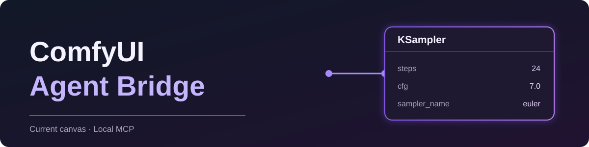

# ComfyUI Agent Bridge

<p align="center"></p>

<p align="center"><strong>让 AI 真正看见你正在使用的 ComfyUI 画布。</strong><br>Live-canvas control for ComfyUI through MCP + Skill.</p>

<p align="center"><a href="https://github.com/sfysyyds/ComfyUI-Agent-Bridge/releases/tag/v1.3.2"><strong>下载 v1.3.2</strong></a> · <a href="#快速安装-windows">快速安装</a> · <a href="#能做什么">功能</a> · <a href="#安全边界">安全边界</a></p>

> [!IMPORTANT]
> 这是社区项目，不是 ComfyUI 官方插件。当前提供经过验证的 **Windows** 安装流程；请勿将没有公网身份认证的 ComfyUI 控制端口暴露到互联网。

## 能做什么

| 当前画布，而不是猜测 | 真正理解第三方节点 |
| --- | --- |
| 读取当前标签页的工作流、节点、连线、视图、revision；空白画布也能直接搭建。 | 从正在运行的 ComfyUI 动态读取节点 schema、输入、输出与选项，不依赖固定节点白名单。 |

| 可控的修改 | 看得见、撤得回 |
| --- | --- |
| 修改前核对工作流身份和版本；批量操作对应一个 Ctrl+Z 单元，不主动保存磁盘工作流。 | 紫色节点流光；可拖动的修改历史面板；按节点单独撤回 AI 修改。 |

AI 还可以读取 **原始工作流、设备与队列状态、近期任务结果、执行错误和桥接命令错误**，而不只是简化摘要。MCP 提供 17 个工具；Skill 规定读取、核对、修改和验证顺序。

## 快速安装（Windows）

1. 从 [v1.3.2 Release](https://github.com/sfysyyds/ComfyUI-Agent-Bridge/releases/tag/v1.3.2) 下载 `ComfyUI-Agent-Bridge-1.3.2.zip` 并解压。
2. 在解压目录打开 PowerShell，执行：

   ```powershell
   powershell -ExecutionPolicy Bypass -File ".\comfyui-agent\scripts\install.ps1" -ComfyUIRoot "C:\你的ComfyUI目录"
   ```

3. **完全重启 ComfyUI 和 AI 客户端**，再打开 ComfyUI。右下角会出现 Agent Bridge 控制台。
4. 运行诊断：

   ```powershell
   powershell -ExecutionPolicy Bypass -File ".\comfyui-agent\scripts\diagnose.ps1" -ComfyUIRoot "C:\你的ComfyUI目录"
   ```

安装器会备份旧插件、Skill 和 Codex 配置；不会修改 ComfyUI 核心。完整步骤见 [使用说明](使用说明.txt) 与 [AI 安装说明](AI安装说明.md)。非 Codex 客户端可按 [AI 安装说明](AI安装说明.md#非-codex-mcp-客户端) 配置本地 stdio MCP。

## 试试这样说

> “读取我当前正在看的 ComfyUI 工作流，说明模型、采样器和输出链路。”

> “这是空白画布。直接在这里搭一套文生图工作流，并高亮新增节点。”

> “检查最近一次生成失败的原始报错，再只修复出错的节点。”

对不认识的非官方节点，智能体应先读取运行时 schema 和实际节点状态，再决定如何连接或设置。修改历史只保留在当前浏览器页面内存中，**刷新页面后不能恢复旧记录**。

## 安全边界

- 默认连接 `http://127.0.0.1:8188`，无公网身份认证层；不要开放到公网。
- 仅支持固定的图操作，不执行任意浏览器 JavaScript、不自动下载模型或安装第三方节点。
- 修改前核对当前页面、工作流 UUID 与 revision；冲突时拒绝套用过时修改。
- 不主动保存工作流文件；若启用了 ComfyUI 自带自动保存，仍以你的 ComfyUI 设置为准。

## 开发与验证

```powershell
powershell -ExecutionPolicy Bypass -File ".\comfyui-agent\scripts\test.ps1"
```

发布前已通过离线测试、真实 ComfyUI 页面上的拖动与单节点撤回测试，以及独立回滚验证。更完整的安装、维护与卸载说明见 [AI 维护说明](AI维护说明.md)。

---

<p align="center">Local-first · Exact workflow identity · Runtime node discovery</p>
